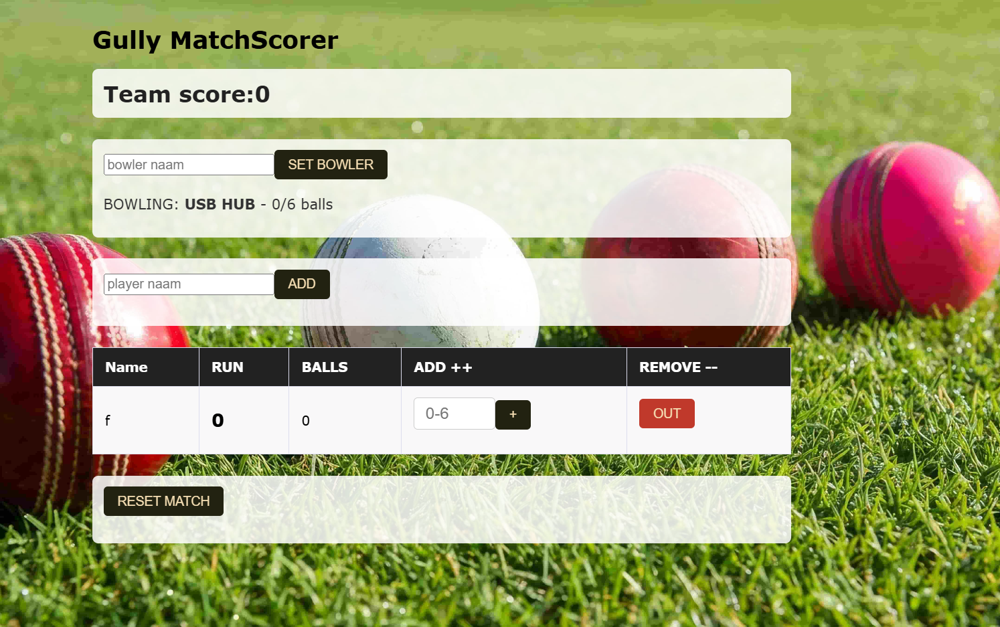

# Gully-Match-scorer

A classic cricket match scorer i amde to score my gully matches.

## Why i made it

To remove cheating and confusion in my gully cricket matches and make them interactive as well as compatible also focused on mobile responsiveness as you are not going to carry a whole laptop on the ground.

## FEATURES

A bowler and batter name adder for scoring with the name

Run and ball counter with over getting automaticly over after 6 ball and bowler changes.

An Out button to remove player if we got out.

The team scoe also gets counted as player score in case you have 2 teams

A Match rset button to change innings and buttons

Contains a simple table like cricket scorer for easy scoring that is it.

## HOW TO USE IT

Just open the link and watch this video for info btw! that much i think you should know

## Video

##Goal

TO impress my gully friend and make their and mine work easy

To ensure fairness

## TECH TRIBUTE

HORIZONS TEAM

LAPTOP

CURSOR CODE EDITOR 

PYTHON FOR CORE LOGIC

CSS FOR STYLING

HTML FOR ACTION AND RESPONSIVITY AND INTERFACE

FLASK FOR DEPLOYEMENT AND CONNECTION OF FRONTEND AND BACKEND

# I aim to update this and deploy a large update

## NOTE 

ITS THE FIRST DEMO AND COULD BE BUGGY

I USED AI FOR FIXING FLASK BUGS AND HELP IN PYTHON LOG FOR RUNS AS I WAS CONFUSED BETWEEN THE APP ROUTE

THANKS FOR READING!!

